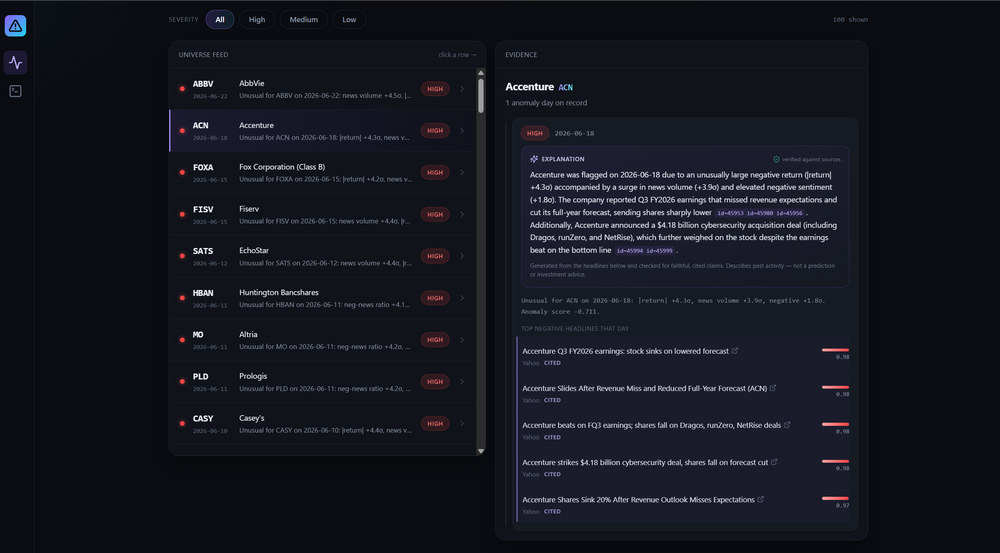

Risk Signal API

A financial NLP system that reads SEC filings and news for roughly 500 S&P companies, detects which companies are behaving abnormally, and explains why using the news that drove each flag. Every explanation is checked against the source data before it is shown, and the system produces nothing when it cannot verify a claim.

It describes what happened. It does not predict prices and it does not give investment advice.

What it does

The system flags 200 company-days as statistically unusual (32 high severity, 152 medium, 16 low). For each flag it shows the anomaly features that triggered it, the news from that day ranked by negative sentiment, and a written explanation grounded in those headlines.

The Accenture example above is representative. The detector flagged 2026-06-18 because the absolute return was 4.3 sigma above normal for Accenture, news volume was 3.9 sigma high, and negative sentiment was elevated. The explanation layer read that day's headlines and attributed the move to a Q3 earnings report that missed revenue expectations and cut full-year guidance, plus a $4.18 billion cybersecurity acquisition. Each claim cites the specific article it came from, and each citation was verified to exist in the database before the explanation was stored.

Compare that to AbbVie in the same feed. It was flagged, but the news linked to it that day was about Iranian oil and SpaceX, nothing about AbbVie. The explanation layer refused to generate anything. That refusal is the intended behavior.

The finding that shaped the design:

Before building any of the serving infrastructure, I tested whether risk language in financial text actually predicts market volatility. Four separate tests:

TestResultFiling risk-language level vs. realized volatilityNo relationship (rho = 0.09)Year-over-year change in filing risk languageNo relationship (rho = 0.004)News sentiment and volume co-moving with volatilityPositive, within-company rho = 0.154 across the universe, rising to roughly 0.20 to 0.22 for the 50 best-covered companies, controlling for betaNews leading volatilityNo relationship

Filing language does not predict volatility. It is boilerplate, it is written by lawyers, and by the time a 10-K is filed the market has already priced whatever it says. News sentiment does track volatility, but it moves with the market rather than ahead of it, which is what an efficient market should look like.

That result is why this is a monitoring and explanation tool instead of a prediction tool. A signal that co-moves with volatility is useless for forecasting and genuinely useful for explaining. Building a price predictor on top of this data would mean claiming something the data does not support.

Architecture

SEC filings + news (500 S&P companies)
        |
        v
  FinBERT scoring  ---------------->  PostgreSQL
  (GPU, 33k+ articles)                    |
        |                                 |
        v                                 |
  Isolation Forest anomaly detection      |
  (per-company standardized features)     |
        |                                 |
        v                                 |
  Grounded explanation layer  <-----------+
  (LLM constrained to computed facts,
   citations verified, abstains on failure)
        |
        v
  C# ASP.NET Core API  -->  React dashboard
  (ONNX inference, auth,
   rate limiting, logging)

Python handles ingestion, scoring, anomaly detection, and explanation. C# serves the model and the analysis. The two are connected by an ONNX export with a verification gate between them.

Engineering

Cross-language model parity

The model trains and exports in Python but serves in C#. A one-token tokenizer difference between the two would silently corrupt every score, and nothing in the output would look wrong.

The export runs the same inputs through PyTorch and through the C# ONNX runtime and compares them. The maximum logit difference is 1.55e-06. The export script exits non-zero if that gate fails, and there is a live /parity endpoint that re-runs the check against the golden reference at request time.

Quantization that was measured and rejected

To fit a free hosting tier I quantized the model to INT8. The file dropped from 418 MB to 105 MB, a 4x reduction, and on the six sample texts every predicted class matched.

Six samples turned out to be a bad test. On a wider set of 30 realistic financial texts the quantized model flipped 4 predicted classes, a 13.3% disagreement rate, with a maximum probability shift of 0.53. It read "a major customer contract was renewed on less favorable terms" as positive where the FP32 model read it as negative.

The script refuses to write a deployable model when classes flip, so it exited non-zero and the INT8 model was not shipped. The measurement is in python/ml/quantize_onnx.py and the numbers are reproducible.

Grounded explanations

The explanation layer does not ask an LLM what it thinks about a company. It hands the model only facts the system computed (the anomaly's sigma values, the company, the date, and that day's headlines with numeric IDs) and requires a citation for every claim.

Four gates run on the response, and each one fails closed:

Parse. The response must be the JSON that was requested.
Citations exist. Every cited article ID must be one that was actually provided.
Faithfulness. Each sentence must lexically overlap the headline it cites.
Policy. The system never recommends. Advice language ("buy", "outperform", "price target") is only permitted when it is attributed to a named source and cited, so "Evercore maintained an Outperform rating [id=5]" passes and "investors should buy" does not.

News headlines are scraped third-party text, which makes them a prompt injection surface. They travel in a labeled data block that the system prompt marks as content to analyze rather than instructions to follow, and the policy gate catches the effect of a successful injection at the output even if the model is fooled.

On the 32 high-severity alerts, 19 explanations were generated and 13 abstained. The abstentions break down as 5 where the model itself declined because the headlines did not explain the flag, 5 caught by the faithfulness check, 2 blocked by the policy gate, and 1 with no headlines to ground on. The abstention rate is a feature. A false abstention is invisible to the user. A fabricated explanation with a citation that does not support it is the failure that destroys trust.

An adversarial test suite covers fabricated citations, unfaithful claims, injected advice, malformed output, and missing citations. Each case must abstain.

MLOps

Every model export is tracked in MLflow with its parameters, the parity delta, and its artifacts. Failed exports are logged too, tagged as failures, before the process exits.

Promotion is a separate, gated step. promote.py registers the export as a new model version and moves the @production alias only if the run passed parity. A failing model still gets registered so the version history is complete, but the alias does not move and the script exits non-zero.

Security

Scoring is authenticated. API keys are stored as SHA-256 hashes, so a database dump yields no usable credentials. Request logs store a hash of the input text rather than the text itself. Per-key rate limiting uses a sliding one-hour window and returns 429 with a Retry-After header.

Anyone can mint a demo key from the scoring page with no signup. Those keys are scoped to /score, capped at about 30 requests per hour, and expire after 24 hours. The minting endpoint is itself rate limited per IP so it cannot be flooded. The blast radius of a leaked demo key is one rate-limited text classifier for one day.

Running it

Docker, with the model mounted:

bashdocker compose up

The API comes up on port 5000 with Postgres alongside it. The ONNX model is not baked into the image; it is mounted read-only from python/artifacts/, so you need to run the export first:

bashcd python
pip install -r requirements.txt
python ml/export_onnx.py     # writes finbert.onnx + parity_reference.json, gated on parity

To run the API directly instead:

bashcd csharp/RiskSignalApi
export RISK_DB_CONNECTION="Host=localhost;Port=5432;Database=risk_signal_db;Username=postgres;Password=..."
dotnet run

The frontend builds into the API's static root:

bashcd frontend
npm install
npm run build

Limitations

The API is not deployed to a public URL yet. It runs locally and in Docker.

Rate limiting is in-memory, so it resets on restart and is per-instance. A multi-instance deployment would need a shared store.

The database connection uses a broad role. Tightening it to least privilege is the obvious next hardening step.

Expired demo keys are rejected but not deleted, so they accumulate as dead rows. A production version would sweep them.

The anomaly detector runs on a fixed historical window. There is no live ingestion, so there is nothing to drift, which is why there is no drift monitoring.

Repository layout

python/
  ml/           scoring, anomaly detection, ONNX export, quantization,
                MLflow promotion, grounded explanation layer
  analysis/     the four-way volatility investigation
  tests/        unit tests, run in CI
csharp/
  RiskSignalApi/    ASP.NET Core API, ONNX inference, auth, rate limiting
frontend/       React dashboard (Vite, Tailwind)
db/             schema and migrations

Stack

Python, FinBERT, ONNX Runtime, scikit-learn, MLflow, C# / ASP.NET Core, React, PostgreSQL, Docker, GitHub Actions.